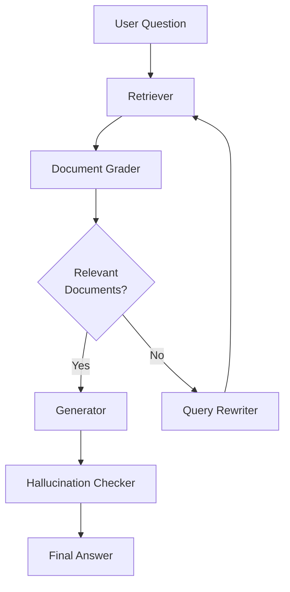
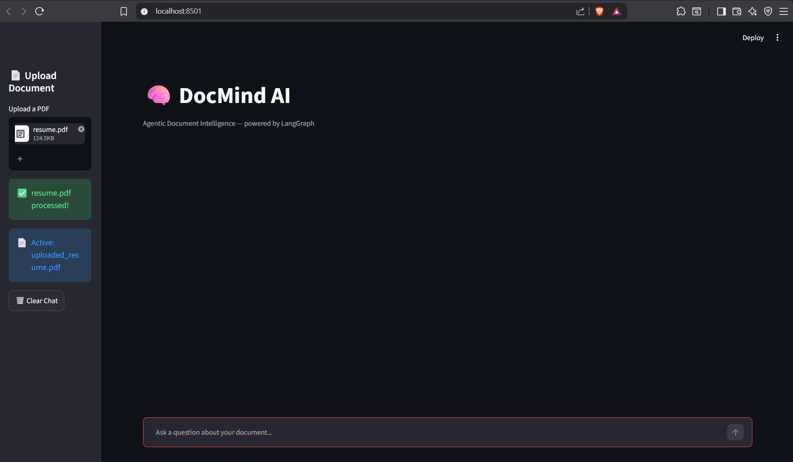
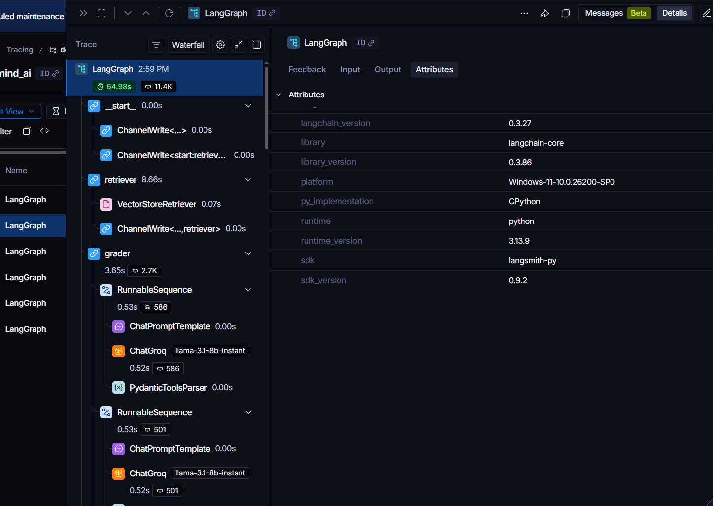
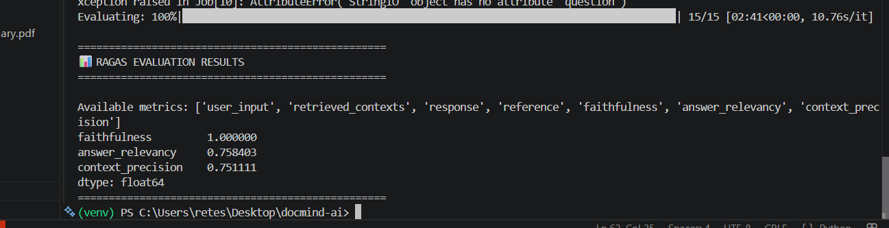

# 🧠 DocMind AI

# 🚀 Overview

DocMind AI is an Agentic Retrieval-Augmented Generation (RAG) system for document-based question answering. The project combines semantic retrieval, intelligent query refinement, and response validation to deliver accurate and context-grounded answers from uploaded PDF documents.

Built using **LangGraph**, the system orchestrates a multi-step workflow consisting of document retrieval, relevance grading, query rewriting, answer generation, and hallucination detection. Document embeddings are stored in **ChromaDB**, enabling efficient semantic search across uploaded content.

To improve reliability, retrieved documents are evaluated through an LLM-based relevance grader, while a query rewriting mechanism helps recover from poor retrieval results. Generated answers are validated against retrieved context to reduce hallucinations and improve trustworthiness.

The workflow is monitored using **LangSmith**, providing end-to-end execution traces for debugging and observability. System performance is evaluated using **RAGAS** metrics such as Faithfulness, Answer Relevancy, and Context Precision to measure retrieval quality and answer grounding.

This project demonstrates modern Agentic AI design patterns, retrieval optimization techniques, workflow observability, and evaluation methodologies used in production-grade RAG systems.


---

# ✨ Key Features

### 📄 Document Intelligence

* PDF Upload & Processing
* Automatic Text Chunking
* Semantic Search using ChromaDB
* Context-Aware Question Answering

### 🤖 Agentic Workflow

* Query Routing
* Document Retrieval
* Relevance Grading
* Query Rewriting
* Answer Generation
* Hallucination Detection

### 📊 Evaluation & Monitoring

* RAGAS Evaluation
* Faithfulness Analysis
* Answer Relevancy Analysis
* Context Precision Analysis
* LangSmith Tracing

### 🎨 User Experience

* Streamlit Chat Interface
* Real-Time Document Upload
* Interactive Question Answering

---

# 🏗️ Agentic RAG Pipeline



### Pipeline Components

| Component             | Purpose                                               |
| --------------------- | ----------------------------------------------------- |
| Retriever             | Retrieves semantically relevant chunks from ChromaDB  |
| Document Grader       | Filters irrelevant retrieved chunks                   |
| Query Rewriter        | Reformulates questions when retrieval quality is poor |
| Generator             | Produces answers grounded in retrieved context        |
| Hallucination Checker | Verifies answer support from retrieved documents      |

This workflow improves retrieval quality and reduces hallucinations compared to traditional single-step RAG systems.

---

# 🖥️ Application Interface

<p align="center">
  
</p>

The application allows users to upload PDF documents and interact with them through a conversational interface powered by an Agentic RAG workflow.

---

# 🔍 LangGraph Execution Trace

<p align="center">
  
</p>

LangSmith tracing provides full visibility into the execution path of the LangGraph workflow, enabling debugging and performance analysis of retrieval, grading, rewriting, generation, and validation stages.

---

# 📈 RAGAS Evaluation Results

<p align="center">
  
</p>

The system was evaluated using the RAGAS framework to measure retrieval quality and answer grounding.

| Metric            | Score |
| ----------------- | ----- |
| Faithfulness      | 1.00  |
| Answer Relevancy  | 0.758 |
| Context Precision | 0.751 |

### Interpretation

* **Faithfulness (1.00)** → Generated answers remain fully grounded in retrieved context.
* **Answer Relevancy (0.758)** → Responses effectively address user queries.
* **Context Precision (0.751)** → Retrieved chunks are largely relevant to the question.

---

# 🛠️ Tech Stack

## AI & LLM Frameworks

* LangGraph
* LangChain
* Groq LLMs
* HuggingFace Embeddings

## Vector Database

* ChromaDB

## Frontend

* Streamlit

## Evaluation & Observability

* RAGAS
* LangSmith

## Programming Language

* Python

---

# 📂 Project Structure

```text
DOCMIND-AI/
│
├── app/
│   ├── graph.py
│   ├── nodes.py
│   ├── rag_chain.py
│   ├── vectorstore.py
│   ├── ingestion.py
│   └── state.py
│
├── ui/
│   └── streamlit_app.py
│
├── evaluation/
│   └── ragas_eval.py
│
├── screenshots/
│   ├── ui_chat.png
│   ├── langsmith_trace.png
│   └── ragas_eval.png
│
├── requirements.txt
├── README.md
└── .gitignore
```

---

# ⚙️ Installation

## Clone Repository

```bash
git clone https://github.com/Retesh07/DOCMIND_AI.git
cd DOCMIND_AI
```

## Install Dependencies

```bash
pip install -r requirements.txt
```

## Configure Environment Variables

Create a `.env` file:

```env
GROQ_API_KEY=your_groq_api_key
LANGCHAIN_TRACING_V2=true
LANGCHAIN_API_KEY=yout_langchain_api_key
LANGCHAIN_PROJECT=doc_mind_ai
LANGCHAIN_ENDPOINT=https://api.smith.langchain.com
```

## Run Application

```bash
streamlit run ui/streamlit_app.py
```

---

# 🎯 Engineering Challenges Solved

* Designed a multi-node Agentic RAG workflow using LangGraph.
* Implemented LLM-based document relevance grading.
* Added query rewriting to recover from poor retrieval results.
* Built a hallucination validation stage to improve answer reliability.
* Integrated LangSmith for workflow tracing and debugging.
* Evaluated retrieval performance using RAGAS metrics.

---

# 🔮 Future Enhancements

* Hybrid Search (BM25 + Vector Search)
* Cross-Encoder Re-ranking
* Multi-Document Retrieval
* Citation Generation
* Local LLM Support using Ollama
* Multi-Agent Workflows
* Long-Term Conversation Memory

---

# 👨‍💻 Author

**Retesh G.S.**

Final Year Engineering Student

Areas of Interest:

* Agentic AI Systems
* Retrieval-Augmented Generation (RAG)
* Large Language Models
* Backend Development
* Applied Artificial Intelligence

---

⭐ If you found this project useful, consider giving it a star.
