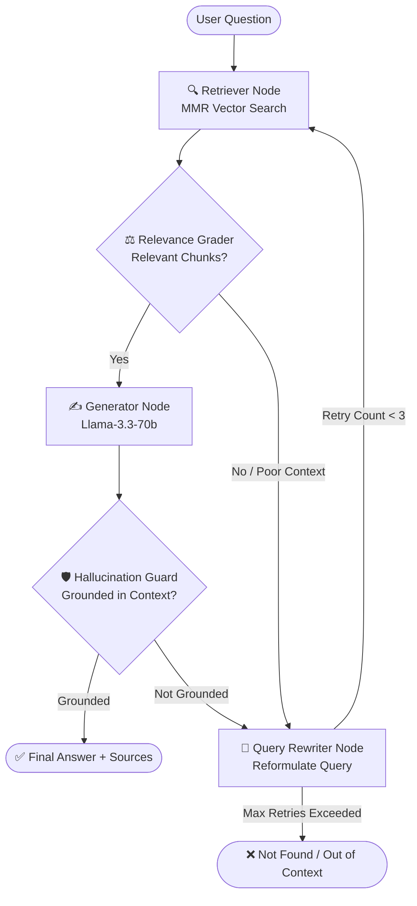
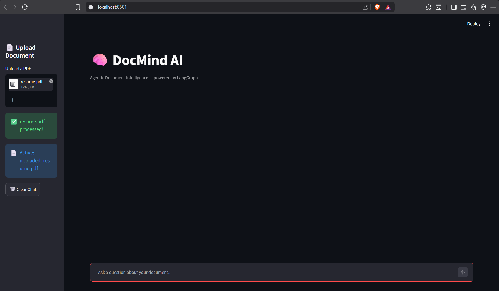
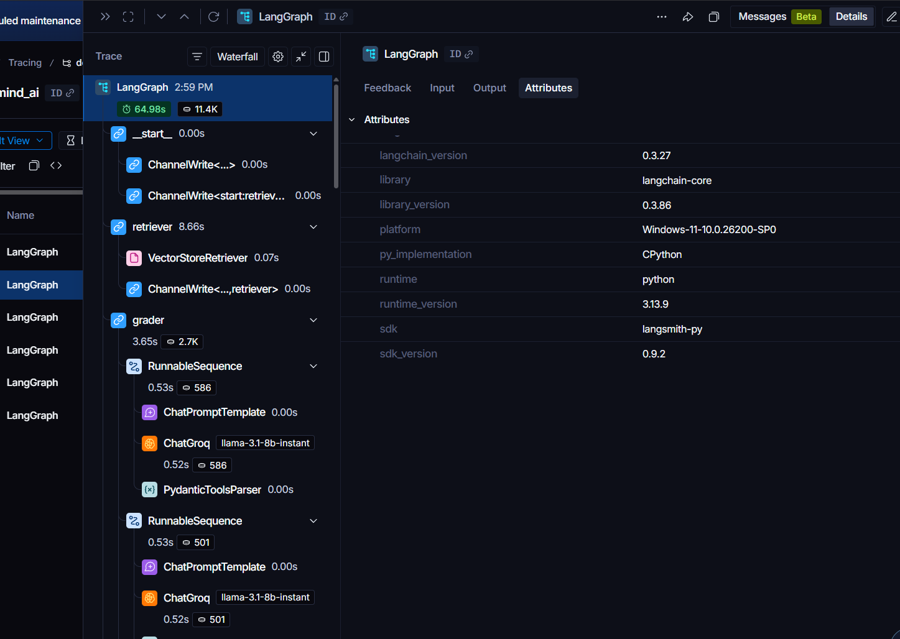
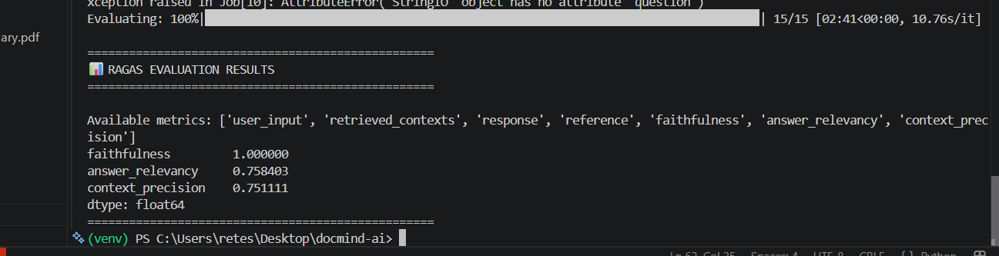

# 🧠 DocMind AI: Agentic RAG System
> **An intelligent, self-correcting Document Question-Answering system powered by LangGraph, ChromaDB, Groq LLMs, and SHA-256 content-addressable caching.**

[](https://www.python.org/)
[](https://langchain-ai.github.io/langgraph/)
[](https://groq.com/)
[](https://www.trychroma.com/)
[](https://streamlit.io/)
[](https://www.docker.com/)

---

## 🚀 Overview

**DocMind AI** is an advanced Agentic Retrieval-Augmented Generation (RAG) platform designed for reliable document-based question answering. Unlike naive, linear RAG pipelines that blindly feed retrieved chunks directly into an LLM, DocMind AI utilizes an **autonomous LangGraph state machine** to actively critique, rewrite, and validate retrieved knowledge.

Key engineering highlights:
* **Self-Reflective Loops:** Evaluates retrieved chunks with an LLM-based grader and autonomously rewrites search queries when retrieval quality is insufficient.
* **Hallucination Detection:** Verifies that the generated answer is strictly factually grounded in the retrieved source context before returning it to the user.
* **Deterministic SHA-256 Caching:** Implements content-addressable hashing across both the frontend and backend to eliminate redundant chunking and re-embedding.
* **Full Observability:** End-to-end tracing with **LangSmith** and quantitative evaluation using **RAGAS** metrics.

---

## ✨ Key Features

### 📄 Intelligent Ingestion & SHA-256 Caching
* **Streamlit Client-Side Deduplication:** Truncated SHA-256 hash computed on uploaded file bytes to prevent re-processing identical files in the same session.
* **Persistent Content-Addressable Vector Cache:** Backend hashes PDF byte streams in 8 KB blocks to generate deterministic storage paths (`/tmp/chroma_db/<pdf_name>_<pdf_hash>`), reusing existing ChromaDB collections and saving compute.
* **Semantic Chunking:** Text splitting configured with `RecursiveCharacterTextSplitter` (1000 chunk size, 400 overlap) to preserve context continuity across page boundaries.
* **MMR (Maximal Marginal Relevance) Retrieval:** Uses HuggingFace `all-MiniLM-L6-v2` embeddings with MMR search (`k=5`, `fetch_k=20`, `lambda_mult=0.7`) to maximize information diversity while filtering redundancy.

### 🤖 Agentic LangGraph Workflow
* **Query Routing & Retrieval:** Fetches semantically similar chunks from ChromaDB.
* **Relevance Grader:** Uses high-throughput, low-latency models (`llama-3.1-8b-instant`) to filter out irrelevant chunks.
* **Adaptive Query Rewriter:** When documents fail relevance grading, rewrites the user query to retrieve better context.
* **Context-Grounded Answer Generation:** Generates comprehensive answers using high-capability models (`llama-3.3-70b-versatile`).
* **Hallucination Guardrails:** Inspects the answer against retrieved documents to ensure zero hallucination before serving.

### 📊 Observability & Evaluation
* **LangSmith Tracing:** Inspect step-by-step latency, tokens, and node decisions.
* **RAGAS Benchmark:** Evaluated on Faithfulness, Answer Relevancy, and Context Precision.

---

## 🏗️ Agentic RAG Pipeline Architecture


```mermaid
flowchart TD
    Start([User Question]) --> Retriever[🔍 Retriever Node\nMMR Vector Search]
    Retriever --> Grader{⚖️ Relevance Grader\nRelevant Chunks?}
    
    Grader -->|Yes| Generator[✍️ Generator Node\nLlama-3.3-70b]
    Generator --> HallucinationChecker{🛡️ Hallucination Guard\nGrounded in Context?}
    
    HallucinationChecker -->|Grounded| FinalAnswer([✅ Final Answer + Sources])
    HallucinationChecker -->|Not Grounded| Rewriter
    
    Grader -->|No / Poor Context| Rewriter[🔄 Query Rewriter Node\nReformulate Query]
    Rewriter -->|Retry Count < 3| Retriever
    Rewriter -->|Max Retries Exceeded| FallbackAnswer([❌ Not Found / Out of Context])
```

### Pipeline Components

| Component | Engine / Model | Purpose |
| :--- | :--- | :--- |
| **Document Ingestion** | PyPDFLoader + RecursiveSplitter | Chunks PDF into overlapping 1000-char blocks |
| **Embedding Model** | `all-MiniLM-L6-v2` (HuggingFace) | Normalized sentence embeddings on CPU |
| **Vector Database** | ChromaDB (MMR Search) | Persists chunk vectors under SHA-256 namespace |
| **Relevance Grader** | `llama-3.1-8b-instant` (Groq) | Evaluates if retrieved chunks contain relevant answers |
| **Query Rewriter** | `llama-3.1-8b-instant` (Groq) | Optimizes query semantics when retrieval fails |
| **Answer Generator** | `llama-3.3-70b-versatile` (Groq) | Synthesizes final grounded response |
| **Hallucination Checker** | `llama-3.1-8b-instant` (Groq) | Verifies response against retrieved source chunks |

---

## 🔐 SHA-256 Caching & Deduplication Architecture

DocMind AI implements **content-addressable storage** via SHA-256 to ensure zero wasted compute:

```
Uploaded PDF
     │
     ├──► [Frontend UI] hashlib.sha256(file_bytes).hexdigest()[:16]
     │         │
     │         ▼
     │    Matches Session State? ──► [YES] ──► Skip Re-ingestion & Retain Chat
     │         │
     │        [NO]
     │         ▼
     └──► [Backend Ingestion] Stream in 8KB blocks ──► get_pdf_hash()
               │
               ▼
          Namespace Path: /tmp/chroma_db/{pdf_name}_{pdf_hash}
               │
          Collection Exists? ──► [YES] ──► Reuse Persisted ChromaDB
               │
              [NO]
               ▼
          Embed chunks & Persist Vectorstore
```

1. **Frontend (`ui/streamlit_app.py`):**
   Computes a 16-character SHA-256 hash directly from uploaded byte data. If the user uploads the same document again, the UI immediately recognizes it and avoids resetting session state or triggering background ingestion.
2. **Backend (`app/vectorstore.py`):**
   Streams the saved file in 8192-byte chunks through `hashlib.sha256()`. Persistent Chroma collections are namespaced with the file's hash (`f"{pdf_name}_{pdf_hash}"`), guaranteeing collision-free caching across reboots and file uploads.

---

## 🖥️ Application Interface

<p align="center">
  
</p>

---

## 🔍 LangSmith Execution Trace

<p align="center">
  
</p>

Full visibility into node transitions, model latency, token counts, and decision branching across all evaluation loops.

---

## 📈 RAGAS Evaluation Results

<p align="center">
  
</p>

| Metric | Score | Industry Benchmark | Description |
| :--- | :---: | :---: | :--- |
| **Faithfulness** | **1.00** | > 0.85 | Zero hallucinations; 100% of generated claims are directly verifiable in source chunks. |
| **Answer Relevancy** | **0.758** | > 0.70 | High semantic alignment between user questions and generated answers. |
| **Context Precision**| **0.751** | > 0.70 | Signal-to-noise ratio: retrieved chunks ranked high in relevance. |

---

## 🛠️ Tech Stack

* **Orchestration:** LangGraph, LangChain
* **LLM Provider:** Groq Cloud (`llama-3.3-70b-versatile`, `llama-3.1-8b-instant`)
* **Embedding Model:** HuggingFace `sentence-transformers/all-MiniLM-L6-v2`
* **Vector Store:** ChromaDB
* **Frontend UI:** Streamlit
* **Security & Caching:** Python `hashlib` (SHA-256)
* **Tracing & Eval:** LangSmith, RAGAS
* **Containerization:** Docker (Python 3.11-slim)

---

## 📂 Project Structure

```text
DOCMIND-AI/
├── app/
│   ├── graph.py            # LangGraph StateGraph builder & compiled workflow
│   ├── nodes.py            # Node logic: Retriever, Grader, Rewriter, Generator, Guard
│   ├── rag_chain.py        # Groq LLM initialization & prompt formatting
│   ├── vectorstore.py      # ChromaDB storage, SHA-256 hashing, MMR retriever
│   ├── ingestion.py        # PyPDFLoader & RecursiveCharacterTextSplitter
│   └── state.py            # AgentState TypedDict definition
├── ui/
│   └── streamlit_app.py    # Streamlit chat interface & upload handling
├── evaluation/
│   ├── ragas_eval.py       # RAGAS evaluation runner
│   └── old_requirements.txt
├── screenshots/
│   ├── ui_chat.png         # UI interface screenshot
│   ├── langsmith_trace.png # LangSmith trace visualization
│   └── ragas_eval.png      # RAGAS benchmark chart
├── Dockerfile              # Production Docker container definition
├── requirements.txt        # Pinned Python dependencies
├── .env.example            # Environment variable template
├── README.md               # Project documentation
└── .gitignore              # Git ignore rules
```

---

## ⚙️ Quick Start

### 1. Clone Repository

```bash
git clone https://github.com/Retesh07/DOCMIND_AI.git
cd DOCMIND_AI
```

### 2. Create Virtual Environment

```bash
python -m venv venv
# On Windows:
venv\Scripts\activate
# On Linux/macOS:
source venv/bin/activate
```

### 3. Install Dependencies

```bash
pip install -r requirements.txt
```

### 4. Configure Environment Variables

Create a `.env` file in the root directory:

```env
GROQ_API_KEY=your_groq_api_key
LANGCHAIN_TRACING_V2=true
LANGCHAIN_API_KEY=your_langchain_api_key
LANGCHAIN_PROJECT=doc_mind_ai
LANGCHAIN_ENDPOINT=https://api.smith.langchain.com
```

### 5. Run the Application

```bash
streamlit run ui/streamlit_app.py
```
Open your browser at `http://localhost:8501` (or port 7860 in Docker).

---

## 🐳 Running with Docker

You can build and run DocMind AI in a container matching the Hugging Face Space configuration:

```bash
# Build Docker image
docker build -t docmind-ai .

# Run Docker container
docker run -p 7860:7860 --env-file .env docmind-ai
```
Navigate to `http://localhost:7860`.

---

## 🎯 Engineering Highlights & Challenges Solved

* **Corrective Self-Healing Workflow:** Eliminated the fragility of standard RAG by introducing conditional routing and retry counters (`retry_count < 3`).
* **Zero Hallucination Guarantee:** RAGAS evaluation scored **1.00 Faithfulness** through explicit post-generation validation checks.
* **Content-Addressable Vector Cache:** Avoided re-generating expensive vector embeddings using 16-character SHA-256 fingerprints.
* **Cost & Latency Optimization:** Routed simple evaluation tasks (grading, rewriting) to fast 8B models while reserving 70B models for answer synthesis.

---

## 🔮 Future Roadmap

* [ ] **FastAPI REST API:** Decouple backend logic into a standalone REST API with Swagger docs (`/api/chat`, `/api/upload`).
* [ ] **Hybrid Search:** Combine BM25 keyword matching with dense vector retrieval.
* [ ] **Cross-Encoder Re-Ranking:** Implement Cohere / BGE Re-rankers to refine top-K chunks.
* [ ] **Multi-Document Support:** Query across collections of multiple uploaded PDFs simultaneously.
* [ ] **Local LLM Support:** Add Ollama integration for fully offline execution.

---

## 👨‍💻 Author

**Retesh G.S.**  
Final Year Engineering Student  
* **GitHub:** [@Retesh07](https://github.com/Retesh07)  
* **Hugging Face:** [@Retesh](https://huggingface.co/Retesh)  

---

⭐ **If you found this project helpful, please consider starring the repository!**
